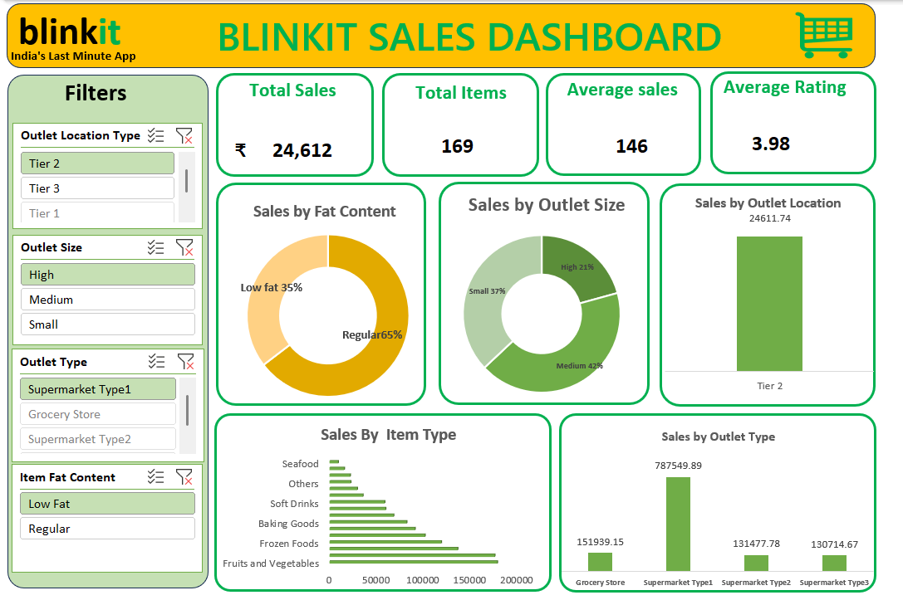

# 📊 Blinkit Sales Dashboard | Microsoft Excel

## 📌 Project Overview

This project is an interactive sales dashboard built in Microsoft Excel to analyze Blinkit's sales performance. The dashboard provides business insights through dynamic filtering, KPI cards, Pivot Tables, and Pivot Charts.

---

## 🎯 Business Objective

The objective of this project is to analyze sales performance across different outlet types, outlet sizes, product categories, and customer ratings to support data-driven business decisions.

---

## 🛠️ Tools & Technologies

- Microsoft Excel
- Power Query
- Pivot Tables
- Pivot Charts
- Slicers
- KPI Cards
- Conditional Formatting
- Dashboard Design

---

## 📈 Dashboard Features

- Interactive KPI Cards
- Total Sales
- Total Items Sold
- Average Sales
- Average Customer Rating
- Sales by Item Type
- Sales by Outlet Type
- Sales by Outlet Size
- Sales by Outlet Location
- Dynamic Filtering using Slicers

---

## 📊 Key Performance Indicators (KPIs)

- Total Sales
- Total Items
- Average Sales
- Average Rating

---

## 📷 Dashboard Preview

## Dashboard Preview

---

## 📂 Project Files

- Blinkit_Sales_Dashboard.xlsx
- Blinkit_Sales_Dashboard.pdf
- dashboard.png
- README.md

---

## 📚 Skills Demonstrated

- Data Cleaning
- Data Transformation
- Data Analysis
- Dashboard Development
- Business Intelligence
- Data Visualization
- Interactive Reporting

---

## 👨‍💻 Author

**Prithvi Raj Singh Adhikari**

Aspiring Data Analyst

LinkedIn: *(Add your LinkedIn profile link here)*

GitHub: *(Add your GitHub profile link here)*
